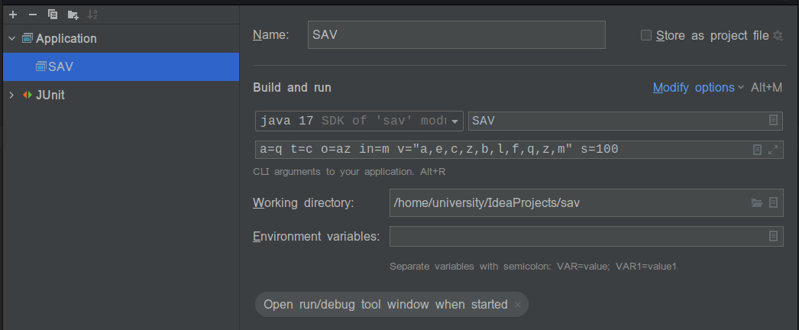
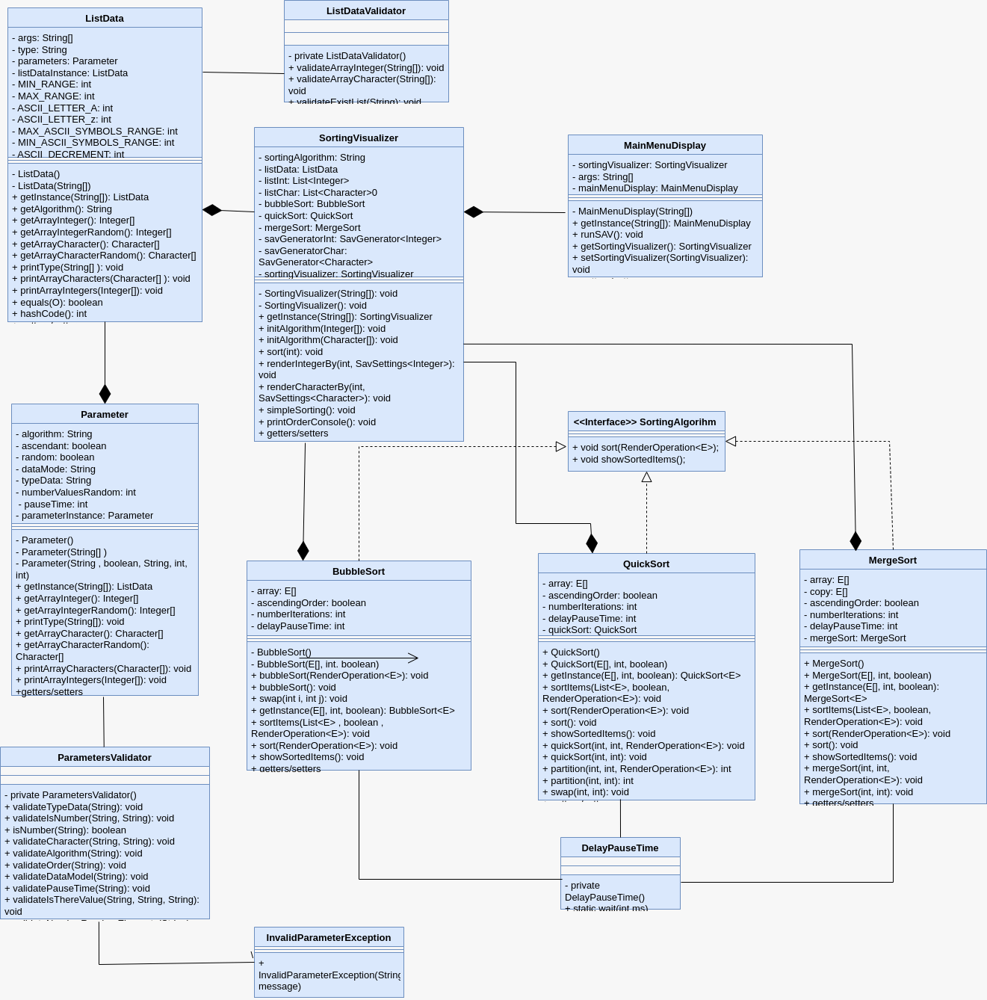

# SAV

## Description

The program orders elements either integers or characters, which are passed as arguments to run the program from the command line, if you want you can specify the algorithm with which you want to order the elements, it is also mandatory to specify what type of data be ordered and their vector together with other parameters that will be specified, the command to execute the program must be done from the out/production/sav folder, otherwise the program will not be executed, before compiling the entire project in that folder , and from the Intellij Idea IDE just compile. Visibilization library by Javier Roca Casap
The algorithms implemented for classification are: BubbleSort, MergeSort and QuickSort. And the parameters that must be specified are:

a => String, which allows you to select one of the three implemented sorting algorithms. The algorithms implemented and accepted at the time of program execution are:

• "B" or "b" -> Bubble sort (default)
• "M" or "m" -> Merge sort
• "Q" or "q" -> Quick sort

o => String, which allows you to select the type of ordering:
"az" or "AZ" for ascending order
"za" or "ZA" for descending order.

in => String
"R" or "r" for representing random values
"M" or "m" for representing values provided by the user.
If the parameter is "in=R," then the following parameter should be considered:

r => number, 1 <= r <= 40
This will generate random values for the list to be sorted, and note that random character values are also generated.

## Example

For example if you want to sort a vector of integers you could do it in the following way:

**java SAV a=b t=n o=az in=r r=10 s=140**
 
**java SAV a=q t=c o=az in=r r=10 s=140**
 
**java SAV a=m t=c o=az in=m v="a,f,r,f,x" s=140**

**Intellij IDEA**

If SAV is executed from the Intellij IDEA IDE settings, it is only necessary to pass the parameters, omitting the "java SAV", some examples:

**a=b t=n o=az in=r r=10 s=140**
 
**a=m t=c o=az in=m v="a,f,r,f,x" s=140**
 
**a=q t=n o=za in=m v="2,3,5,6,7" s=140**

This command will sort the elements with the default algorithm which in this case is "BubbleSort".

The expected inputs and outputs are as follows:

| Input Example                                  | Output Example                                                                                                                                                                  |
|------------------------------------------------|---------------------------------------------------------------------------------------------------------------------------------------------------------------------------------|
| java SAV a=b t=n o=az in=r r=10 s=140          | Type: [Integer] Values: [-2,3,5,8,-5,2,1,30,5,20] Sorting: [-5,-2,1,2,3,5,5,8,20,30] Algorithm: BubbleSort Total time: 1400 ms                                      |
| java SAV a=q t=c o=az in=r r=10 s=140          | Type: [Character] Values: ['A','z','z','s','d','v','M','v','a','r'] Sorting: ['A','M','a','d','r','s','d','v','v','z','z'] Algorithm: QuickSort Total time: 1400 ms |
| java SAV a=m t=c o=az in=m v="a,f,r,f,x" s=140 | Type: [Character] Values: ['a','f','r','f','x'] Sorting: ['a','f','f','r','x'] Algorithm: Merge Sort Total time: 1400 ms                                            |

## Examples about validations

| Input Example                                                                                                   | Output Example                                                                                         |
|-----------------------------------------------------------------------------------------------------------------|--------------------------------------------------------------------------------------------------------|
| Parameter "a", it must only accept 3 values defined by the program.   `java SAV a=1 t=c o=AZ in=r r=100 s=100` | Error, invalid value for algorithm selection                                                           |
| Parameter "a", it must only accept 3 values defined by the program.   `java SAV a= t=c o=AZ in=r r=100 s=100`  | Error, invalid value for algorithm selection                                                           |
| Parameter "a", it must only accept 3 values defined by the program.   `java SAV t=c o=az in=m v="a,f,r,f,x" s=140`  | Error, no value for algorithm selection.                                                               |
| Parameter "t", it only accepts 2 values "c" or "n".   `java SAV a=i t=t o=az in=r r=10 s=140` | Error, unrecognized type                                                                               |
| Parameter "t", it only accepts 2 values "c" or "n".   `java SAV a=i t=134 o=az in=r r=10 s=140` | Error, unrecognized type                                                                               |
| Parameter "t", it only accepts 2 values "c" or "n".   `java SAV a=i  o=az in=r r=10 s=140` | Error, missing type value                                                                              |
| Parameter "o", it only accepts 4 possible values "az", "za", "AZ", "ZA".   `java SAV t=c o=Az in=m v="a,f,r,f,x" s=140` | Error, unrecognized sorting type                                                                       |
| Parameter "o", it only accepts 4 possible values "az", "za", "AZ", "ZA".   `java SAV t=c o=aZ in=m v="a,f,r,f,x" s=140` | Error, unrecognized sorting type                                                                       |
| Parameter "o", it only accepts 4 possible values "az", "za", "AZ", "ZA".   `java SAV t=c o=zz in=m v="a,f,r,f,x" s=140` | Error, unrecognized sorting type                                                                       |
| Parameter "o", it only accepts 4 possible values "az", "za", "AZ", "ZA".   `java SAV t=c o=aa in=m v="a,f,r,f,x" s=140` | Error, unrecognized sorting type                                                                       |
| Parameter "o", it only accepts 4 possible values "az", "za", "AZ", "ZA".   `java SAV t=c o=233 in=m v="a,f,r,f,x" s=140` | Error, unrecognized sorting type                                                                       |
| Parameter "in", it only accepts 4 possible values "r", "R", "M", or "m".   `java SAV a=i t=c o=az in=h r=10 s=140` | Error, invalid value for input type                                                                    |
| Parameter "in", it only accepts 4 possible values "r", "R", "M", or "m".   `java SAV a=i t=01 o=az in=1 r=10 s=140` | Error, invalid value for input type                                                                    |
| Parameter "in", it only accepts 4 possible values "r", "R", "M", or "m".   `java SAV a=i t= o=az in= r=10 s=140` | Error, invalid value for input type                                                                    |
| Parameter "in", it only accepts 4 possible values "r", "R", "M", or "m".   `java SAV a=i o=az r=10 s=140` | Error, missing input type                                                                              |
| Parameter "r", it only accepts values between 1 and 40.   `java SAV a=i t=n o=az in=r r=0 s=140` | Error, invalid number of values to generate                                                            |
| Parameter "r", it only accepts values between 1 and 40.   `java SAV a=i t=n o=az in=r r=a s=140` | Error, invalid number of values to generate                                                            |
| Parameter "r", it only accepts values between 1 and 40.   `java SAV a=i t=c o=az in=r s=140` | Error, missing number of values to generate                                                            |
| Parameter "s", it only accepts values between 100 and 1000.   `java SAV a=i t=c o=az in=r r=10 s=99` | Error, invalid delay value                                                                             |
| Parameter "s", it only accepts values between 100 and 1000.   `java SAV a=i t=c o=az in=r r=10 s=1001` | Error, invalid delay value                                                                             |
| Parameter "s", it only accepts values between 100 and 1000.   `java SAV a=i t=c o=az in=r r=10 s=df` | Error, invalid delay value                                                                             |
| Parameter "s", it only accepts values between 100 and 1000.   `java SAV a=i t=c o=az in=r r=10` | Error, missing delay value                                                                             |
| Parameter "v" is conditioned to values "in=m" and "t=c/n".   `java SAV a=i t=c o=az in=m v="1,1,r,f,x" s=140` | Type: [Character]   Values: ['1','1','r','f','x']   Invalid values                               |
| Parameter "v" is conditioned to values "in=m" and "t=c/n".   `java SAV a=i t=n o=az in=m v="1,0,3,5,x" s=140` | Type: [Integer]   Values: [1,0,3,5,x]   Invalid values                                           |
| Parameter "v" is conditioned to values "in=m" and "t=c/n".   `java SAV a=i t=c o=az in=m v="" s=140` | Type: [Character]   Values: []   Sorting: []   Algorithm: InsertionSort   Total time: 0 ms |
| Parameter "v" is conditioned to values "in=m" and "t=c/n".   `java SAV a=i t=c o=az in=m  s=140` | Type: [Integer]   Invalid values                                                                    |
| Parameter "r" only accepts values between 1 and 40.   `java SAV a=i t=n o=az in=r r=0 s=140` | Type: [Integer]   Number of values to generate invalid                                              |
| Parameter "r" only accepts values between 1 and 40.   `java SAV a=i t=n o=az in=r r=a s=140` | Type: [Integer]   Number of values to generate invalid                                              |
| Parameter "r" only accepts values between 1 and 40.   `java SAV a=i t=c o=az in=r s=140` | Type: [Integer]   Missing number of values to be generated                                          |
| Parameter "s" only accepts values between 100 and 1000.   `java SAV a=i t=c o=az in=r r=10 s=99` | Type: [Integer]   Values: [-2,3,5,8,-5,2,1,30,5,20]   Value for delay pause invalid              |
| Parameter "s" only accepts values between 100 and 1000.   `java SAV a=i t=c o=az in=r r=10 s=1001` | Type: [Integer]   Values:  [-2,3,5,8,-5,2,1,30,5,20]   Value for delay pause invalid                                       |
| Parameter "s" only accepts values between 100 and 1000.   `java SAV a=i t=c o=az in=r r=10 s=df` | Type: [Integer]   Values:  [-2,3,5,8,-5,2,1,30,5,20]   Value for delay pause invalid                                       |
| Parameter "s" only accepts values between 100 and 1000.   `java SAV a=i t=c o=az in=r r=10` | Type: [Integer]   Values:  [-2,3,5,8,-5,2,1,30,5,20]   Missing value for delay pause                                       |

## Class Diagram

